# Baranguard — Workflows & Business Rules (Code-Verified)

> **Barangay Intelligence and Emergency Dispatch System**  
> Operational reference for Pilar, Sorsogon (Dao, Binanuahan, Marifosque, Banuyo).  
> *Audited and reconciled directly against the backend, web, and mobile codebase on 2026-10-02; updated 2026-10-07 for the Proposed Changes Review decisions and re-checked 2026-10-08 against the code (nav/landing pages in `web/src/main.js` and `AppShell.js`, incident and dispatch rules in `IncidentsController`/`DispatchController`, sync in `SyncController`/`syncService.ts`, offers in `OfferService`) after Gap-X1/X2/X3. Code-complete, verified on disposable databases only; not browser- or device-verified.*

---

# Part 1: End-User Workflows

Baranguard serves **4 end-user personas** (the anonymous citizen form was retired; walk-ins are logged by the Secretary or Admin), each with distinct device interfaces, permission scopes, and responsibilities.

```
+---------------------------------------------------------+
|                  BARANGUARD END USERS                   |
+----------------------------+----------------------------+
| Web Dashboard Users        | Mobile App Users           |
| - Admin (Chief Tanod)      | - Tanod                    |
| - Secretary                | - Admin (Chief Tanod) on   |
| - Punong Barangay          |   phone: SOS + dispatch    |
+----------------------------+----------------------------+
```

---

## 1. 🔵 Admin (Chief Tanod / Desk Officer)

* **Platform:** Web Desktop (`https://baranguardph.win`)
* **Default Landing Page:** `dashboard`
* **Core Function:** Day-to-day dispatch command, tanod tracking, roster drafting, user provisioning, system health, and Annex D report preparation.

### Complete Navigation Reach (12 sidebar pages + a 4-page "System Tools" group = 16 pages)
`dashboard`, `dispatch`, `incident-management`, `gis`, `citizen-inbox` (legacy reports only), `approvals`, `accomplishment-reports`, `referrals`, `school-zones`, `analytics`, `personnel`, `settings`, plus **System Tools** (one grouped menu holding `sms-log`, `audit-log`, `service-health`, `map-packages`). No separate technical-admin role exists: the barangay officials operate these themselves. `settings` is unchanged.

### Operational Flow

```mermaid
flowchart TD
    Login["1. Log In (Web)"] --> Dash["2. Admin Dashboard"]
    
    Dash --> Disp["Dispatch Center"]
    Disp --> DispQueue["View Pending Incidents"]
    DispQueue --> DispAssign["Assign On-Duty Tanod (POST /dispatch)"]
    DispAssign --> DispTrack["Monitor Live En Route / Arrived Units"]
    DispTrack --> DispCancel["Cancel Dispatch (mandatory reason; allowed before or after arrival)"]
    DispQueue --> DispReopened["Reopened incidents are queued here too (REOPENED badge) and can be dispatched"]
    DispQueue --> DispOffer["Night / on demand: Broadcast offer to on-duty tanods (first accept wins)"]
    DispAssign --> DispOverride["No published shift? Assign anyway with a mandatory override reason"]

    Dash --> GIS["GIS Live Tracking"]
    GIS --> GISPoll["View Tanod Markers (polls every 15s)"]
    GISPoll --> GISAlert["Identify SOS Alarms & Stale Tanod Units (>120s)"]

    Dash --> IncMgmt["Incident Management"]
    IncMgmt --> IncCreate["Log New Incident or Link to School"]
    IncMgmt --> IncDetail["Open Incident Detail"]
    IncDetail --> IncResolve["Resolve Incident (Admin only; only a dispatched incident, zero active dispatches)"]
    IncMgmt --> IncDispatch["Dispatch / Resolve buttons are Admin-only (Secretary sees a note instead)"]

    Dash --> PersHub["Personnel Hub"]
    PersHub --> UsersTab["Users: Create / Suspend / Set Title & Authorities"]
    PersHub --> SchedTab["Scheduler: Review Availability & Draft Shifts ('Create shift from this availability' prefills the form)"]
    SchedTab --> PublishShifts["Publish Roster (Requires approve_roster authority)"]
    PersHub --> SwapsTab["Shift Swaps: Approve or Reject Tanod Swap Requests"]

    Dash --> ApprInbox["Approvals Inbox"]
    ApprInbox --> ApprAvail["Review Tanod Availability Windows"]
    ApprInbox --> NoteReports["Note Accomplishment Reports (Requires note_report authority)"]
    ApprInbox --> PrepAnnexD["Prepare Annex D Report (Requires prepare_annex_d authority)"]

    Dash --> SysHealth["Service Health & Ops"]
    SysHealth --> CheckProbes["Check MariaDB / ORS / GSM Gateway / FCM / Cloudflared"]
    SysHealth --> RunBackup["Inspect Daily Backup & Weekly Restore Drill Telemetry"]
    SysHealth --> SMSMon["SMS Monitor: Inbound Carrier SMS & Bulk Broadcast"]
```

---

## 2. 🟢 Secretary (Records & Reports Officer)

* **Platform:** Web Desktop (`https://baranguardph.win`)
* **Default Landing Page:** `incident-management` *(Code: `main.js` routes secretary directly here; dashboard is inaccessible to Secretary)*
* **Core Function:** Statutory records custodian (RA 7160 §394c), confidential narrative reviewer, incident lifecycle governor, Safer School Zones administrator, walk-in incident logging, draft rosters and swap review, and paper-approval recording.

### Complete Navigation Reach (8 Sidebar Items)
`incident-management`, `citizen-inbox` (legacy), `approvals`, `accomplishment-reports`, `referrals`, `school-zones`, `personnel`, `settings`.  
*(Excluded by `PAGE_ROLES`: `dashboard`, `dispatch`, `gis`, `analytics`, `sms-log`, `audit-log`, `service-health`, `map-packages`)*

### Operational Flow

```mermaid
flowchart TD
    Login["1. Log In (Web)"] --> IncMgmt["2. Incident Management (Default Landing)"]
    
    IncMgmt --> OpenDetail["Open Incident Detail (no Dispatch/Resolve controls for the Secretary)"]
    OpenDetail --> ReadNarrative["Read Confidential Raw Narrative (Secretary ONLY)"]
    OpenDetail --> ReadParties["View Complainant & Respondent Contact Details"]
    OpenDetail --> ChangeLifecycle["PATCH /incidents/:id/lifecycle"]
    ChangeLifecycle --> MarkDup["Mark Duplicate (Must link duplicate_of_incident_id)"]
    ChangeLifecycle --> MarkInvalid["Mark Invalid or Cancelled"]
    ChangeLifecycle --> Reopen["Reopen a Closed/Terminal Incident"]
    OpenDetail --> EditC1["Edit School Incident Annex C-1 Text"]
    OpenDetail --> LogReferral["Record External Agency Referral"]

    IncMgmt --> LogWalkIn["Log Walk-in Incident (report channel: tanod-alerted / walk-in / SMS / other)"]
    OpenDetail --> LinkRelated["Link Related Incident (no status change; finalize as duplicate after dispatch closes)"]

    Login --> CitInbox["Citizen Reports Inbox (legacy rows only)"]
    CitInbox --> ConvertCit["Convert Legacy Citizen Report to Official Incident"]

    Login --> SSZ["Safer School Zones Hub"]
    SSZ --> AnnexB["Schools Tab: Maintain Annex B School Inventory"]
    SSZ --> AnnexC1["Incidents Tab: Review School Incidents & C-1 Notes"]
    SSZ --> AnnexD["Term Report Tab: Live Term Counts & Prepare/Approve Annex D"]
    AnnexD --> MarkSub["Mark Annex D as Submitted to DILG"]

    Login --> AccReports["Accomplishment Reports Hub"]
    AccReports --> ReviewEntries["Inspect Tanod Duty Entries (back-dated up to 62 days) & Flagged Variances"]
    ReviewEntries --> NoteOrApprove["Note or Approve Report (If granted note_report / approve_report)"]
    ReviewEntries --> ReturnReport["Return Report to Tanod (Mandatory return_reason)"]

    Login --> Pers["Personnel Hub"]
    Pers --> ViewSched["Scheduler Tab: Create / Edit Draft Shifts (Publish needs approve_roster)"]
    Pers --> SwapRev["Swap Requests Tab: Approve or Reject"]
    AccReports --> PaperRec["Record Paper Signature Date / Record Approval From Paper / Upload Scan"]
```

---

## 3. 🟡 Punong Barangay (Barangay Captain / Executive Oversight)

* **Platform:** Web Desktop (`https://baranguardph.win`)
* **Default Landing Page:** `dashboard` (Read-only executive analytics with pending approvals widget)
* **Core Function:** Executive oversight, high-level intelligence and GIS monitoring, and statutory signing/approval authority for rosters, accomplishment reports, and term submissions.

### Complete Navigation Reach (9 Sidebar Items)
`dashboard`, `gis`, `approvals`, `accomplishment-reports`, `referrals`, `school-zones`, `analytics`, `personnel`, `settings`.  
*(Excluded by `PAGE_ROLES`: `dispatch`, `incident-management`, `citizen-inbox`, `sms-log`, `audit-log`, `service-health`, `map-packages`)*

### Operational Flow

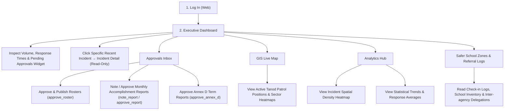

---

## 4. 🔴 Tanod (Patrol Responder / Field Operative)

* **Platform:** Mobile Android App (Ionic React + Capacitor + SQLCipher encrypted database)
* **Shell Structure:** 5 Persistent Bottom Tabs (`Home`, `Dispatches`, `Report [+]`, `Map`, `Profile`) + Contextual Sub-Pages.
* **Core Function:** Responding to emergency dispatches, emergency SOS panic broadcast, turn-by-turn navigation, photo/audio evidence collection, school zone check-ins, availability submission, and daily accomplishment reporting.

### Operational Flow

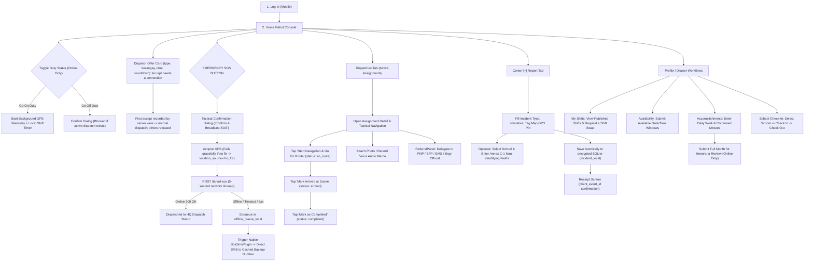

---

## 5. Chief Tanod on the phone (Admin account, one account)

* **Platform:** the same Android app; an Admin login on a phone gets a device session limited to a fixed allow-list.
* **Stage 1 (built):** acknowledge SOS (never resolve), list/assign/cancel dispatches (cancel needs a reason; assigning without a published shift needs an override reason), broadcast or cancel dispatch offers, read incidents. Resolution stays on the web dashboard.
* **Not on the phone:** user management, reports, exports, settings, availability, accomplishments.

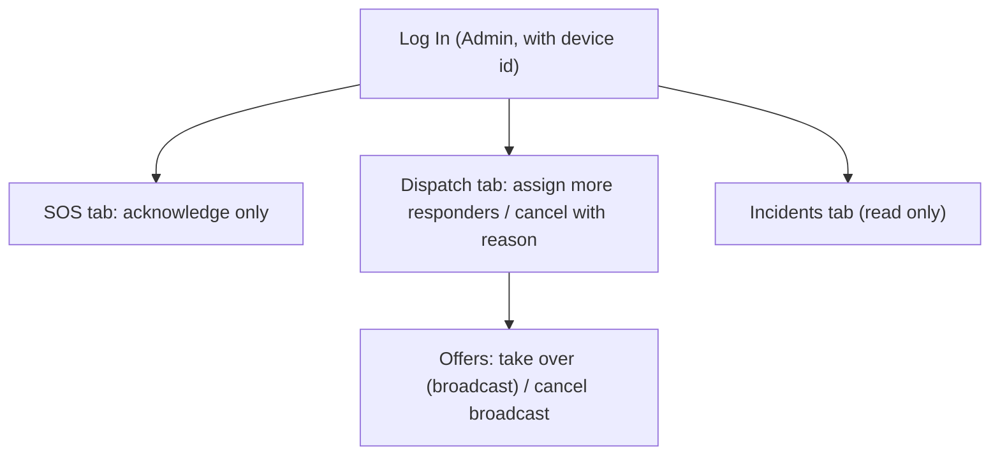

---

# Part 2: Codebase State Machines

Every state machine in Baranguard is strictly validated on the backend. The following tables and diagrams show the exact states, trigger endpoints, and database columns.

---

### 1. Incident Lifecycle & Resolution
* **Database Columns:** `incident.status` (`pending`, `dispatched`, `resolved`, `duplicate`, `invalid`, `cancelled`, `reopened`) and `incident.duplicate_of_incident_id`
* **Authority Gate:** Admin resolves (`/status`, only from `dispatched`); Secretary governs records lifecycle (`/lifecycle`). Cancelling the last active dispatch of a `dispatched` incident returns it to `pending`.

```mermaid
stateDiagram-v2
    [*] --> pending : Reported by a Tanod, or logged by the Secretary/Admin (walk-in, SMS, other; legacy citizen reports are converted)
    pending --> dispatched : Admin creates dispatch assignment
    dispatched --> pending : All active dispatches cancelled
    dispatched --> resolved : Admin resolves (Requires ALL dispatches completed/cancelled)
    
    pending --> duplicate : Secretary marks duplicate (Requires duplicate_of_incident_id link)
    pending --> invalid : Secretary marks invalid
    pending --> cancelled : Secretary cancels incident
    
    dispatched --> duplicate : Secretary (Blocked if active dispatch open)
    dispatched --> invalid : Secretary (Blocked if active dispatch open)
    dispatched --> cancelled : Secretary (Blocked if active dispatch open)
    
    resolved --> reopened : Secretary reopens case
    duplicate --> reopened : Secretary reopens case
    invalid --> reopened : Secretary reopens case
    cancelled --> reopened : Secretary reopens case
    
    reopened --> dispatched : Admin dispatches a tanod (a reopened incident is dispatchable like a pending one)
    reopened --> duplicate : Secretary (Blocked if active dispatch open)
    reopened --> invalid : Secretary (Blocked if active dispatch open)
    reopened --> cancelled : Secretary (Blocked if active dispatch open)
```

---

### 2. Dispatch Assignment Status
* **Database Column:** `dispatch.status` (`assigned`, `en_route`, `arrived`, `completed`, `cancelled`)
* **Trigger Endpoints:** Admin creates/cancels (`/dispatch`, `/dispatch/:id/cancel`); Tanod advances (`PATCH /dispatch/:id/status`).

```mermaid
stateDiagram-v2
    [*] --> assigned : Admin assigns Tanod to incident
    assigned --> en_route : Tanod taps 'Start Navigation'
    en_route --> arrived : Tanod taps 'Mark Arrived at Scene'
    arrived --> completed : Tanod taps 'Mark as Completed'
    
    assigned --> cancelled : Admin cancels (Mandatory reason recorded)
    en_route --> cancelled : Admin cancels (Mandatory reason recorded)
    arrived --> cancelled : Admin cancels (Mandatory reason; unblocks a stuck dispatch)
    
    completed --> [*] : Terminal state
    cancelled --> [*] : Terminal state
```

---

### 3. Monthly Accomplishment Report
* **Database Column:** `accomplishment_report.status` (`open`, `prepared`, `noted`, `approved`, `returned`)
* **Authority Gate:** Tanod submits; holders of `note_report` note; holders of `approve_report` approve. Preparer can never note/approve (`assertNotPreparer`).

```mermaid
stateDiagram-v2
    [*] --> open : Created for Tanod for month YYYY-MM
    open --> prepared : Tanod submits month (Online only)
    prepared --> noted : Desk / Official notes report (Requires note_report)
    noted --> approved : Punong Barangay approves report (Requires approve_report)
    
    prepared --> returned : Official returns report with return_reason
    noted --> returned : Official returns report with return_reason
    
    returned --> prepared : Tanod edits entries & resubmits
    approved --> [*] : Locked in-system; flagged "paper signature pending" until the paper date is recorded (paper is the official copy)
```

---

### 4. Shift Schedule & Roster Publication
* **Database Column:** `shift_schedule.approval_status` (`draft`, `published`) plus `pending_reapproval`
* **Authority Gate:** Admin or Secretary creates draft; holder of `approve_roster` publishes (or Secretary/Admin records a paper approval naming a signer who holds it).

```mermaid
stateDiagram-v2
    [*] --> draft : Admin creates shift from availability or scratch
    draft --> published : Official publishes via POST /shifts/publish (approve_roster, or Secretary/Admin recording a paper approval)
    
    published --> draft : Material edit to shift user_id, start_at, or end_at
    published --> draft : Shift swap approved (flag pending_reapproval; tanod still sees the shift)
    
    note right of published : Visible on Tanod mobile app
```

---

### 5. Safer School Zones Annex D Term Report
* **Database Column:** `ssz_term_report.status` (`draft`, `prepared`, `approved`, `submitted`)
* **Authority Gate:** Admin/Secretary drafts; `prepare_annex_d` prepares; `approve_annex_d` approves; Admin/Secretary marks submitted. Preparer cannot approve.

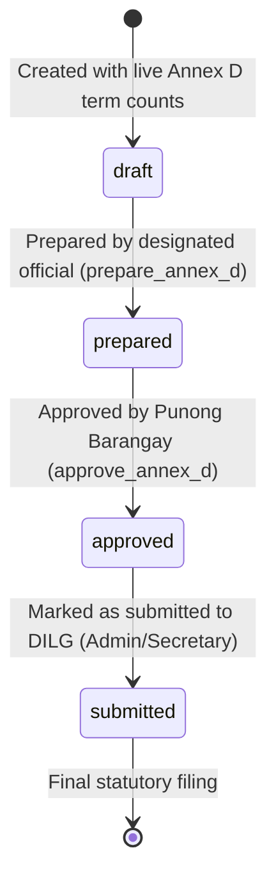

---

### 6. Dispatch Offer (night broadcast)
* **Database Column:** `dispatch_offer.status` (`open`, `escalated`, `accepted`, `closed`, `cancelled`). `closed` means settled without a tanod accepting: an Admin assigned directly, or the incident was resolved/cancelled/merged meanwhile.
* **Trigger:** every new pending incident at night (18:00 to 06:00 Manila) or an Admin/Secretary broadcast on demand; accept is online-only.

```mermaid
stateDiagram-v2
    [*] --> open : Broadcast to on-duty tanods with a published shift (round 1 of 3)
    open --> accepted : First accept recorded by the server wins; others released
    open --> open : 180 s with no accept: next round re-broadcast, Admins alerted
    open --> escalated : No qualifying tanod or round 3 expired
    escalated --> accepted : A tanod accepts
    open --> closed : Admin assigns directly (POST /dispatch) or the incident is no longer open
    escalated --> closed : Admin assigns directly (POST /dispatch) or the incident is no longer open
    open --> cancelled : Admin cancels
    escalated --> cancelled : Admin cancels
    accepted --> [*]
    cancelled --> [*]
    closed --> [*]
```

---

### 7. Tanod Emergency SOS Panic Alert
* **Database Column:** `tanod_sos.status` (`active`, `acknowledged`, `resolved`)
* **Trigger Endpoints:** Tanod triggers (`POST /tanod-sos`); Admin acknowledges (`/acknowledge`, also from the Chief Tanod phone); Admin resolves on the web (`/resolve`). An SOS also alerts every on-duty tanod and every active Admin.

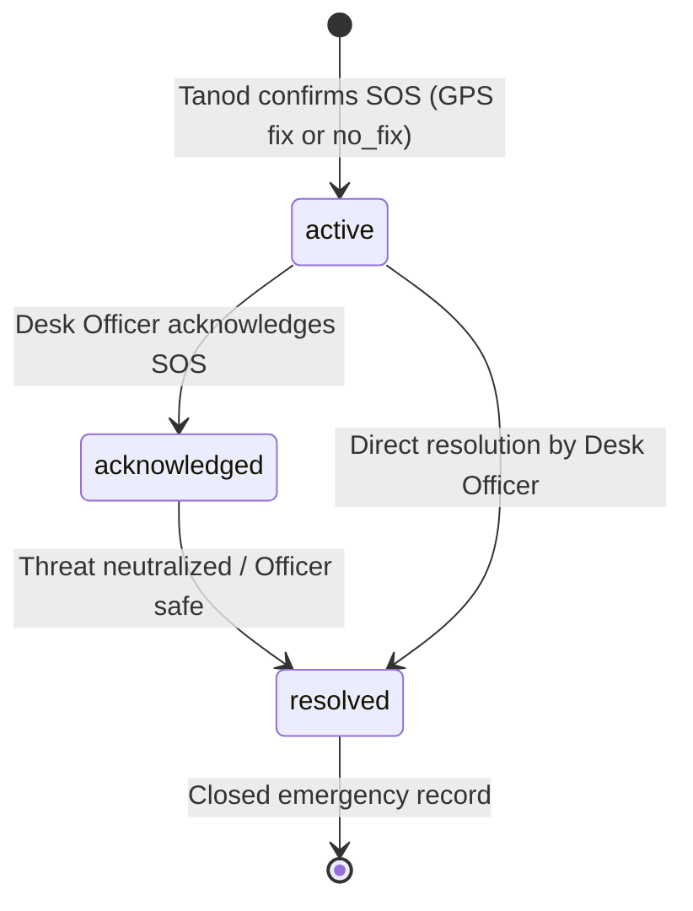

---

# Part 3: Business Rules (One Sentence Per Rule)

### I. Authentication, Sessions & Tenancy
1. Every authenticated user must supply a valid username and password; there is no anonymous access to any write route (the public citizen form was retired; the public transparency read endpoint remains).
2. An account is locked for 15 minutes after 5 failed login attempts within a rolling 15-minute window.
3. Web sessions use a 15-minute sliding JWT refreshed automatically by dashboard polling, while mobile tanod and Admin (Chief Tanod) device sessions use a 24-hour sliding token capped at 7 days; an Admin device session can only reach a fixed allow-list of endpoints.
4. Logging out, suspension, deactivation, or password changes instantly revoke all active session tokens on the server.
5. All tenant-isolated database queries strictly enforce `barangay_id`, and any cross-tenant request returns a `404 Not Found` rather than a `403` to prevent confirming the existence of resources in other barangays.
6. Server-side middleware validates role, tenant, and resource ownership on every protected endpoint; client-side guards are never treated as security boundaries.

### II. Incident Dispatch & Operations
7. Only an Admin can create a dispatch assignment (for a `pending`, `reopened` or `dispatched` incident), except at night or on demand, when an offer is broadcast to on-duty tanods and the first accept recorded by the server creates the dispatch.
8. A Tanod cannot be dispatched if they are off-duty, already responding, inactive, suspended, or from another barangay, and must hold a published shift covering the current time unless the Admin gives a mandatory override reason.
9. An incident supports multiple concurrent responder dispatches without artificial priority gates.
10. Cancelling an active dispatch (assigned, en route or arrived, always with a mandatory reason) reverts an incident to `pending` only when no other active responder remains assigned.
11. An Admin can resolve an incident only when it is `dispatched` and all associated responder dispatches are marked completed or cancelled; a pending or reopened incident must be dispatched first.
12. Only a Secretary can modify an incident's statutory lifecycle to `duplicate`, `invalid`, `cancelled`, or `reopened`.
13. Marking an incident as `duplicate` strictly requires linking it to a target `duplicate_of_incident_id` within the same barangay, preserving both records without deleting or merging data.
14. A terminal incident state (`resolved`, `cancelled`, `invalid`, `duplicate`) can only transition to `reopened` and cannot jump directly to another terminal state.
15. Incident status or lifecycle modifications are rejected with a conflict error if an active dispatch is open; a related-incident link is the exception because it never changes status.
16. Web writes require a UUID `Idempotency-Key` and mobile writes require a `client_event_id`; replayed requests return the original row rather than creating duplicates.

### III. Data Privacy, Redaction & Statutory Compliance
17. Raw incident narratives are stored encrypted and never transmitted via push notifications, SMS alerts, server logs, or audit metadata.
18. Only a Secretary can view an incident's confidential raw narrative and party contact details; Admins and Punong Barangays receive only non-identifying operational summaries.
19. All raw narratives are permanently purged after a mandatory 90-day retention ceiling.
20. Audit log entries are strictly append-only and record allow-listed entity identifiers and statuses without personal identifiers, narratives, or coordinates.
21. Baranguard strictly functions as an operational dispatch tool and may never be presented as replacing DILG's mandated BIMSS/KPIS case registry.

### IV. Emergency SOS & Field Safety
22. The emergency SOS broadcast must never be blocked by a missing or failed GPS fix; the server records a fallback position or flags the alert as `no_fix`.
23. If the server is unreachable, the mobile app sends a direct emergency SMS to the cached backup contact number via the phone's native SIM.
24. Acknowledging an SOS alert notifies the operator but does not dismiss the visual emergency alert banner until the distress is explicitly marked resolved.
25. The SOS mobile trigger opens a tactical confirmation dialog to prevent accidental triggers while guaranteeing immediate transmission upon confirmation.

### V. Scheduling, Rostering & Duty Limits
26. Newly created shifts (by an Admin or Secretary) default to `draft` status and remain invisible on the mobile app until published by an official holding `approve_roster` authority, or recorded as approved on paper by a Secretary or Admin naming a signer who holds it.
27. A Tanod cannot be scheduled for more than 12 hours within a single Asia/Manila calendar day.
28. Materially editing a published shift's assigned officer, start time, or end time reverts it to `draft` and revokes its approval; when the cause is an approved swap the shift stays visible to the tanod flagged `pending_reapproval` until it is re-published.
29. Shift swap requests raised against `draft` shifts return a `404 Not Found` because draft rosters are hidden from field personnel.
30. Missing duty coverage across a patrol zone generates a warning during roster publication but does not block publication.
31. *(Merged into Rule 28; number kept so older citations still line up.)*

### VI. Tanod Availability & Accomplishment Reports
32. A Tanod can revise and resubmit duty availability time windows for a period while its status is `submitted` (or `revised`, when a reviewer asked for changes), but modifications are locked once `accepted`.
33. The server computes suggested duty durations from recorded `on_duty` intervals and flags any accomplishment entry where the Tanod's confirmed duration differs by more than 30 minutes.
34. Final monthly accomplishment reports must be submitted online and cannot be queued through the offline sync worker.
35. The preparer of an accomplishment report can never note or approve their own report.
36. Administrators cannot grant or revoke approving authorities on their own user account; changes require action from a second administrator.

### VII. Agency Referrals & External Handoffs
37. Logging an inter-agency referral records an operational handoff to an external body without altering the incident's dispatch status.
38. The referral log exposes only destination agency categories and reference codes, excluding personal identifying information and narrative text.

### VIII. Safer School Zones (DILG MC 2026-037)
39. School check-in timestamps must be valid ISO-8601 strings within 5 minutes in the future and no older than 62 days in the past.
40. School check-out timestamps cannot precede check-in and must occur within 24 hours of arrival.
41. An invalid or inactive `school_id` submitted from mobile is saved as NULL rather than rejecting the offline incident report.
42. Annex D term reports require preparation by an official with `prepare_annex_d` and approval by a separate official with `approve_annex_d` before being marked submitted.
43. School incident records carry short, non-identifying Annex C-1 fields that strictly forbid recording student names or identifying details.

### IX. Mobile Offline Architecture & Sync Queue
44. Every mobile field submission persists immediately to encrypted local SQLite storage before navigation can continue.
45. Mobile synchronization processes queued items in strict priority: SOS alerts first, dispatch updates second, incidents third, workflow items fourth, and GPS breadcrumbs last.
46. The mobile app sends sync payloads in chunks of 50 items, the server rejects a batch above 200 items, and GPS breadcrumbs are capped at 200 points per sync pass.
47. Duplicate sync payloads matching an existing `client_event_id` return the existing server row rather than throwing an error.
48. Non-transient client sync rejections revert optimistic local status changes and mark the queue item as requiring attention.
49. Duty status cannot be toggled while offline, and an officer cannot declare themselves off-duty while an active dispatch assignment remains open.

### X. Data Retention, Backup & System Governance
50. Retention rules are enforced as constants in code, and modifications require architectural and council policy approval.
51. GPS tracking breadcrumbs, duty status logs, shift assignments, and notification records are purged after a 1-year retention period.
52. Encrypted database backups run nightly and restore drills execute weekly via automated workstation scheduled tasks.
53. While any legal hold is active, no backup is pruned (this covers every backup existing when the hold was placed and every backup created while it stays active).
54. All server timestamps are stored in UTC, and calendar day calculations use a fixed Asia/Manila (+08:00) offset in PHP rather than SQL timezone conversions.
55. The workstation serves four fixed barangays in Pilar, Sorsogon, and expanding tenant coverage requires schema migrations.

### XI. Review-Decision Additions (2026-10-07)
56. The anonymous public citizen report form no longer exists; walk-ins are logged by the Secretary or Admin and every incident records a report channel from a fixed list (tanod-alerted, walk-in, SMS, other).
57. A dispatch offer is broadcast only to active, on-duty tanods who hold a published shift covering the current time and have no active dispatch, and its alert shows only incident type, barangay and time.
58. Accepting a dispatch offer is online-only, never queued; the first accept the server records wins, all other recipients are released, and an Admin can still assign additional responders.
59. An offer nobody accepts within 180 seconds re-broadcasts (up to three rounds) and alerts the Admins, then stays escalated with spaced Admin reminders until someone assigns or cancels.
60. At night (18:00 inclusive to 06:00 exclusive, Asia/Manila) every new pending incident opens an offer automatically; during the day the Admin assigns.
61. A related-incident link between two incidents of the same barangay changes no status and may be set while a dispatch is open; the Secretary finalizes a duplicate only after the dispatch closes.
62. An approved accomplishment report or Annex D is locked in the system; it shows "paper signature pending" until a Secretary or Admin records the signed-on-paper date, and the paper copy is the official record.
63. A Secretary or Admin may record an approval from paper for an absent signer, who must hold the matching authority and must not be the preparer; the signer, date and recorder are stored and audited.
64. A scan attached to a report must be a PDF, JPG or PNG of at most 10 MB, is visible to Admin, Secretary and Punong Barangay, lives as long as its parent report, and must contain no student names.
65. Retention periods for availability, accomplishment reports, school check-ins and referrals are placeholders pending barangay confirmation, so nothing is purged from those tables yet.
66. An Admin (Chief Tanod) may sign in on the mobile app with a device session limited to SOS acknowledgement, dispatch override and read access.

### XII. Gap-X Additions (2026-10-08)
67. A `reopened` incident is treated like a `pending` one for dispatching and dispatch offers, and appears in the Dispatch Center queue and the GIS active-incident filter.
68. Dispatch and Resolve controls in Incident Management are shown to the Admin only; the Secretary sees a read-only note (the server already enforced this).
69. A draft shift can be created from a submitted availability entry; it is prefilled from the tanod's window and is still saved as `draft`.
70. A tanod can capture photo or voice evidence on an assigned incident while offline; it shows as waiting for a connection until the server confirms the upload.

---

# Part 4: Scenario Walk-Throughs (for checking)

Each scenario is one realistic story you can follow step by step and compare with the app. "Rules" points to Part 3, "State" to Part 2, "Evidence" to the automated suite that exercises it on a disposable database. None of these has been run in a browser or on a device by an agent (see `docs/HANDOFF.md`). Where a UAT ID is given it comes from `docs/chapter4-instruments/04-uat-signoff.html`.

| # | Scenario | Roles |
|---|---|---|
| 1 | Daytime incident from report to resolution | Tanod, Admin |
| 2 | Night incident: dispatch offer, first accept wins | System, Tanod, Admin |
| 3 | Dispatching without a published shift | Admin |
| 4 | Cancelling a dispatch, and a second responder | Admin |
| 5 | Wrong or duplicate report: Secretary lifecycle and reopening | Secretary, Admin |
| 6 | Resolve guards | Admin |
| 7 | SOS with and without signal or GPS | Tanod, Admin |
| 8 | Roster: availability to published shift, swap and 12-hour cap | Tanod, Admin, Secretary, Punong Barangay |
| 9 | Monthly accomplishment report | Tanod, officials |
| 10 | Annex D term report and school check-in | Tanod, Secretary, officials |
| 11 | Who can read the confidential narrative | All roles |
| 12 | Login lockout, revocation and the Chief Tanod phone | Any, Admin |
| 13 | Referral to another agency | Tanod, Secretary |
| 14 | Offline duplicates | Tanod |

### Scenario 1. Daytime incident from report to resolution
1. A tanod saves a new incident on the phone with no signal. It is written to encrypted SQLite first and shows a receipt (Rules 44, 47).
2. Signal returns. The sync queue sends SOS first, then dispatch status, then incidents, with workflow items and GPS last, in chunks of 50 (Rules 45, 46).
3. The incident appears as `pending` in the Admin's Dispatch Center queue.
4. It is daytime (06:00 to 18:00 Manila), so no offer opens. The Admin presses "Dispatch Tanod" and picks an on-duty tanod who has a published shift covering now (Rules 7, 8, 60). The incident becomes `dispatched`; the dispatch is `assigned`.
5. The tanod taps Start Navigation, then Mark Arrived, then Mark as Completed (`assigned` to `en_route` to `arrived` to `completed`).
6. The Admin resolves the incident. This is allowed only because the incident is `dispatched` and no dispatch is still open (Rule 11).
- **Expected end state:** incident `resolved`, dispatch `completed`.
- **State:** 1, 2. **Evidence:** `verify-sprint3.sh`, `verify-w3-w4-dispatch-gis.sh`. **UAT:** T-01 to T-10, A-03.

### Scenario 2. Night incident: dispatch offer, first accept wins
1. A new incident is created at 22:30 Manila time. Between 18:00 (inclusive) and 06:00 (exclusive) an offer opens automatically (Rule 60). The Admin can also broadcast one by hand in the day ("Broadcast to on-duty tanods").
2. Only active, on-duty tanods with a published shift covering now and no active dispatch receive it. The alert shows only type, barangay and time (Rule 57).
3. Two tanods tap Accept. Accepting needs a connection and is never queued. The server records the first accept as the winner and releases the other (Rule 58).
4. The winner gets a normal dispatch. The Admin can still add more responders.
5. Variation: nobody accepts within 180 seconds. The offer re-broadcasts and alerts the Admins, for up to three rounds, then stays `escalated` with spaced Admin reminders until someone assigns or cancels (Rule 59; reminders at +3, +6, +12 minutes, then every 30, at most 8).
- **State:** 6. **Evidence:** `verify-dispatch-offers.sh` (193 checks). **Not demonstrated:** two truly concurrent accepts, because the test server is single-threaded.

### Scenario 3. Dispatching without a published shift
1. The Admin tries to assign a tanod who has no published shift covering the current time.
2. The server refuses with `NO_PUBLISHED_SHIFT`.
3. The Admin enters an override reason and assigns anyway. The reason text is stored, but its content is never written to the audit log (only that a reason existed and its length).
4. Assigning a tanod who is off duty, already responding, suspended, inactive or from another barangay is refused regardless (Rule 8).
- **Evidence:** `verify-wave1a-dispatch-roster.sh`. **UAT:** A-03, A-04, A-05.

### Scenario 4. Cancelling a dispatch, and a second responder
1. The Admin assigns tanod A, then presses "Add Responder" and assigns tanod B (Rule 9).
2. The Admin cancels tanod A's dispatch with the reason left empty. It is refused; a reason of 1 to 255 characters is required (Rule 10).
3. With a reason entered, A's dispatch becomes `cancelled`. B is still active, so the incident stays `dispatched`.
4. The Admin cancels B after B has marked arrived. This is allowed (cancel works from `arrived`). Now no responder is left, so the incident returns to `pending`.
- **State:** 1, 2. **Evidence:** `verify-second-responder.sh`, `verify-wave1a-dispatch-roster.sh`. **UAT:** A-06, A-07, A-08.

### Scenario 5. Wrong or duplicate report: Secretary lifecycle and reopening
1. A walk-in reports a fire already logged by a tanod. The Secretary opens the second incident and chooses Mark as duplicate without choosing the original. It is refused: a duplicate must link a `duplicate_of_incident_id` in the same barangay (Rule 13).
2. A dispatch is still open on it. The change is refused with a conflict (Rule 15). After the dispatch closes, marking it duplicate with the link works. Nothing is deleted or merged; both records stay (Rule 13).
3. While a dispatch is still open the Secretary can still use "Link related incident", because it changes no status (Rules 15, 61).
4. A `resolved`, `duplicate`, `invalid` or `cancelled` incident can only go to `reopened`; it can never jump to another terminal state (Rule 14).
5. After the Secretary reopens an incident, the Admin sees it in the Dispatch Center queue with a REOPENED badge and can dispatch it like a pending one (Rule 67). The Secretary sees no Dispatch or Resolve buttons, only a note (Rule 68).
- **State:** 1. **Evidence:** `verify-h16-incident-lifecycle.sh` (47 checks, includes the reopened-dispatch case). **UAT:** S-04 to S-08, A-18, S-20.

### Scenario 6. Resolve guards
1. The Admin tries to resolve a `pending` incident that was never dispatched. It is refused: "Only a dispatched incident can be resolved."
2. The incident is dispatched but a tanod is still `en_route`. Resolve is refused because it still has an active dispatch.
3. After all dispatches are `completed` or `cancelled`, resolve succeeds.
4. A reopened incident follows the same path: it must be dispatched first, then resolved.
- **Rules:** 11. **Evidence:** `verify-sprint1-remaining.sh`, `verify-h16-incident-lifecycle.sh`.

### Scenario 7. SOS with and without signal or GPS
1. Online with GPS: the tanod presses SOS and confirms ("Confirm & Broadcast SOS"). The server stores it `active`, and on-duty tanods and every active Admin are alerted.
2. Online without a GPS fix: the SOS is still accepted. It uses the tanod's last known position, or is stored with `location_source = no_fix` and no coordinates (Rule 22).
3. No signal (or the server times out after 5 seconds): the SOS is queued locally and the phone sends a direct SMS to the cached backup contact through its own SIM (Rule 23). The app shows a badge for the SMS result (`sent_by_sms`, `sms_pending`, `sms_failed`).
4. The Admin acknowledges (`acknowledged`) from the web or from the Chief Tanod phone console. Acknowledging does not clear the alert; only an explicit resolve on the web does (Rule 24). The Chief Tanod phone can acknowledge but never resolve.
5. The Admin can also resolve an `active` SOS directly.
- **State:** 7. **Evidence:** `verify-sprint4.sh`. **Device-verified once (2026-09-24):** the successful `sent_by_sms` path only; the `sms_failed` path and the no-GPS change are code-only. **UAT:** T-05 to T-08.

### Scenario 8. Roster: availability to published shift, swap and 12-hour cap
1. The tanod submits available windows for a period on the phone (Availability). While `submitted` the tanod can edit and resubmit (the version goes up); once `accepted` it is locked (Rule 32).
2. The Admin or Secretary reviews it: `accepted`, or `revised` with a note (a revised period can be resubmitted).
3. In Personnel, Scheduler, the Admin presses "Create shift from this availability". The form is prefilled and the shift is saved as `draft` (Rules 26, 69). The tanod cannot see it yet.
4. Scheduling the same tanod for more than 12 hours in one Manila day is refused with `DAILY_HOURS_EXCEEDED` (Rule 27). Missing coverage is only a warning at publish (Rule 30).
5. An official holding `approve_roster` (usually the Punong Barangay) publishes. The shift becomes visible to the tanod. If nobody with that authority is present, a Secretary or Admin can record a paper approval naming a signer who holds it (Rules 26, 63).
6. A swap request on a `draft` shift returns 404 (Rule 29). On a published shift the swap goes to the Admin or Secretary for review.
7. Changing the tanod, start or end of a published shift reverts it to `draft` (Rule 28). An approved swap also sets it to `draft` with `pending_reapproval`, but the tanod still sees it.
- **State:** 4 and the availability appendix below. **Evidence:** `verify-roster-accomplishment.sh` (332), `verify-scheduler-fatigue.sh`, `verify-paper-approvals.sh`. **UAT:** S-19, A-19, P-05. **Not demonstrated:** the 12-hour cap under real concurrent writes.

### Scenario 9. Monthly accomplishment report
1. During the month the tanod enters daily work on the phone with a confirmed duration of 1 to 1440 minutes. A work date in the future or more than 62 days back is refused (Rule 33).
2. The server stores its own suggested duration from on-duty time. If the two differ by more than 30 minutes the entry is flagged for the approver (Rule 33).
3. The tanod submits the whole month online. It cannot be queued offline (Rule 34). Status goes `open` to `prepared`.
4. An official with `note_report` notes it (`noted`). An official with `approve_report` approves it (`approved`). The tanod, as preparer, can never note or approve their own report (Rule 35).
5. An official who disagrees returns it with a reason (1 to 255 characters). The tanod edits and resubmits.
6. An approved report is locked. It shows "paper signature pending" until the Secretary or Admin records the date it was signed on paper, and the paper copy is the official record (Rule 62).
7. An Admin cannot grant or remove their own `approve_*` authorities; a second Admin must (Rule 36).
- **State:** 3. **Evidence:** `verify-roster-accomplishment.sh`, `verify-paper-approvals.sh` (271). **UAT:** P-06.

### Scenario 10. Annex D term report and school check-in
1. The tanod checks in at a school on the phone and later checks out. A check-in time more than 5 minutes ahead or more than 62 days back is refused. A check-out before the check-in, or more than 24 hours after it, is refused (Rules 39, 40).
2. The Secretary maintains the school list (Annex B). On an incident the school link and the short Annex C-1 text are stored apart from the narrative, with no student names (Rule 43). On a mobile report an unusable `school_id` is saved as empty so the offline report still goes through (Rule 41).
3. The Secretary or Admin creates the Annex D term report from live term counts (`draft`). An official with `prepare_annex_d` prepares it. A different official with `approve_annex_d` approves it. The Secretary or Admin marks it submitted (Rule 42).
- **State:** 5. **Evidence:** `verify-school-zones.sh` (213). **UAT:** S-10 to S-12, P-07. **Open:** the circular's deadlines and Annex A are unknown, so no deadline is hardcoded.

### Scenario 11. Who can read the confidential narrative
1. The Secretary opens an incident detail: the raw narrative and party contacts are shown (Rule 18).
2. The Admin opens the same incident: no narrative and no party contacts.
3. The Punong Barangay opens it from the dashboard: operational summary only, read-only.
4. A user from another barangay requests the same incident id: the answer is `404`, never `403` (Rule 5).
5. The narrative never appears in push notifications, SMS, logs or audit metadata (Rule 17), and is purged at 90 days (Rule 19).
- **Evidence:** `verify-sprint7-pentest-incidents.sh`, `verify-b2-pentest-remaining-resources.sh`, `verify-sprint7-audit.sh`. **UAT:** S-03.

### Scenario 12. Login lockout, revocation and the Chief Tanod phone
1. Five wrong passwords lock the account for 15 minutes (Rule 2).
2. An Admin suspends a user. The user's very next request fails, because the session is checked on every request (Rule 4).
3. A tanod logging in on a registered phone gets a 24-hour sliding device session capped at 7 days. A web login gets a 15-minute sliding token (Rule 3).
4. The Admin logs in on the phone with a device id. The session works only for the fixed allow-list (SOS acknowledge, dispatch assign and cancel, offers, read-only incidents). Anything else returns 403 `DEVICE_SESSION_SCOPE` (Rule 66).
- **Evidence:** `verify-auth-lockout-revocation.php`, `verify-device-session.sh`, `verify-chief-tanod-mobile.sh` (174). **UAT:** C-01 to C-06.

### Scenario 13. Referral to another agency
1. At a fire the tanod opens the assignment, taps "Refer This Case", chooses BFP (or EMS, PNP and so on) and records it (Rule 37).
2. The dispatch and incident status do not change. The record means "handed over", not "accepted".
3. The Secretary, Admin and Punong Barangay see it in the Referral Log: incident, type, agency, time and reference only, with no names or narrative (Rule 38).
- **Evidence:** `verify-referrals.sh` (147). **UAT:** T-27, P-08.

### Scenario 14. Offline duplicates
1. A tanod saves an incident, loses signal mid-upload and the app retries.
2. The retry carries the same `client_event_id` and `X-Device-Id`. The server returns the original row and creates no second incident (Rule 47).
3. A web write retried with the same `Idempotency-Key` behaves the same way (Rule 16).
4. If the server permanently rejects a queued item, the optimistic local change is reverted and the item is marked as needing attention (Rule 48).
- **Evidence:** `verify-sprint3.sh`, `verify-f5`, `verify-f6` and `verify-f8` suites. **Not device-verified:** offline durability across a real app kill or reboot.

---

## Appendix: Availability states (not in Part 2 above)
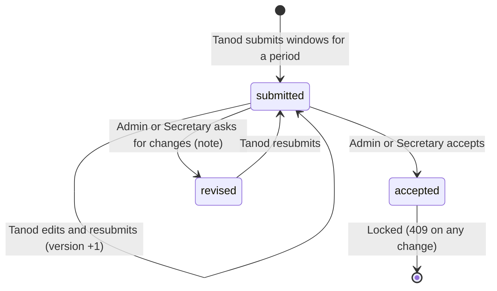

## What did not fit, found during this re-check
- The old incident diagram allowed `pending` to `resolved` and `reopened` to `pending`; the code allows neither (fixed in Part 2).
- Rule 24 (acknowledge does not clear the alert banner) and the SOS fallback badge states describe UI behaviour read from the project docs, not re-run.
- The accomplishment return reason and the 62-day back-date limit are in the scenarios and in Rule 33 only partly; they have no rule of their own.
- Retention for the new tables is undecided (Rule 65), so no scenario can say when that data is deleted.


---

# Part 5: Logic Review (does the whole thing hang together?)

Reviewed 2026-10-08 by reading the rules against each other and against the code. Most of the rule set is consistent. The items below are the places where the logic is thin, one-sided or silently depends on something outside the system. None is a confirmed bug unless it says so; each needs a decision from you or the barangay.

### Consistent (checked, no contradiction found)
- **Authority is layered and non-overlapping:** the Admin owns dispatch and resolution, the Secretary owns the record lifecycle and narrative, approvals follow a separate authority attribute, and the Punong Barangay is oversight plus approval (Rules 7, 12, 18, 26, 35).
- **Time rules agree:** UTC storage, fixed +08:00 days, the night window, the 12-hour cap and school check-in limits all use the same Manila day (Rules 27, 54, 60).
- **Every offline write has a duplicate guard** (`client_event_id` or `Idempotency-Key`), and the things that must not be queued (duty toggle, month submit, offer accept) are the same ones that need a live server answer (Rules 16, 34, 49, 58).
- **Privacy rules do not conflict:** the narrative is Secretary-only, never leaves the system, is purged at 90 days, while the incident row keeps for its own period (Rules 17 to 20).

### Gaps and one-sided rules
1. **No way to close an incident that needed no dispatch as `resolved`.** The Admin can resolve only a `dispatched` incident (Rule 11), and the Secretary can only mark `duplicate`, `invalid` or `cancelled`. A report handled by a phone call or a walk-in settled on the spot has no honest ending: it stays `pending`, or is wrongly marked `cancelled`. This matters for the response-time and statistics reports. **Decision needed:** allow Admin resolve from `pending` with a reason, or add a "handled without dispatch" outcome.
2. **SOS can only be resolved on the web.** The Chief Tanod phone may acknowledge but never resolve (Rules 24, 66). If the Admin is away from the desk, the SOS stays `acknowledged` and, per Rule 24, its alert is not cleared until it is resolved. **Decision needed:** whether a phone-side resolve is wanted, or an expected hand-off to the desk.
3. **Segregation of duties is per account, not per person.** The preparer cannot note or approve (Rule 35) and an Admin cannot edit their own approving authorities (Rule 36), but a second Admin can grant them, and one real person could hold two accounts. The rules assume honest staffing in a four-barangay setting. State this assumption in the thesis.
4. **A Chief Tanod on the roster has no operational effect.** The Chief Tanod can be rostered but is never dispatchable, never receives offers and cannot enter accomplishments. Rostering them records presence only. If that is the intent, say so; if not, one of those three needs to change.
5. **Offers and direct dispatch treat the published-shift rule differently.** A direct dispatch can override a missing published shift with a reason (Rule 8); an offer cannot, because recipients must hold a published shift (Rule 57). A tanod who is on duty without a published shift can be assigned by the Admin but never be offered a night incident.
6. **A tanod cannot go off duty while offline** (Rule 49). Combined with the 24-hour device session this is safe, but a tanod who loses signal at the end of a shift stays "on duty" until reconnecting, which may inflate the server's suggested duty duration (not tested). The 30-minute flag (Rule 33) only helps when the tanod confirms a different figure.
7. **Legal hold stops all backup pruning** (Rule 53). That is the safe choice, but backups then grow without limit while any hold exists. Needs a storage budget or a review date for holds.
8. **Retention is incomplete for the records that matter most for honoraria.** Shifts and duty status are purged at 1 year (Rule 51), but accomplishment reports and Annex D have no period (Rule 65). A COA review can reach back further than one year, so the 1-year rule may delete the supporting data before the report that depends on it. Decide the report periods first, then check Rule 51 against them.
9. **The 90-day narrative purge (Rule 19) is policy-unconfirmed.** With the blotter removed there is no "approved redaction" path, so every raw narrative simply expires at 90 days. This is consistent with the barangay keeping its own binder, but it must be confirmed with the barangay.
10. **A reopened incident loses its closing history in the status field.** After `resolved` then `reopened` then `dispatched`, only the audit log shows the earlier closure. Acceptable, but anyone reading the incident detail should be pointed at the timeline.

### How I would use this
Items 1, 2 and 8 are decisions that change behaviour; 3, 4, 5, 6, 7, 9 and 10 are mostly things to state in the thesis or confirm with the barangay. None blocks the UAT, but item 1 is likely to come up in the Chief Tanod and Secretary scenarios, so decide it before you run them.
