# Baranguard — Workflows & Business Rules (Code-Verified)

> **Barangay Intelligence and Emergency Dispatch System**  
> Operational reference for Pilar, Sorsogon (Dao, Binanuahan, Marifosque, Banuyo).  
> *Audited and reconciled directly against the backend, web, and mobile codebase on 2026-10-02.*

---

# Part 1: End-User Workflows

Baranguard serves **5 end-user personas**, each with distinct device interfaces, permission scopes, and responsibilities.

```
┌────────────────────────────────────────────────────────────────────────┐
│                        BARANGUARD END USERS                            │
├───────────────────────┬────────────────────────┬───────────────────────┤
│ Web Dashboard Users   │ Mobile App Users       │ Public Users          │
│ • Admin (Chief Tanod) │ • Tanod                │ • Citizen (Anonymous) │
│ • Secretary           │                        │                       │
│ • Punong Barangay     │                        │                       │
└───────────────────────┴────────────────────────┴───────────────────────┘
```

---

## 1. 🔵 Admin (Chief Tanod / Desk Officer)

* **Platform:** Web Desktop (`https://baranguardph.win`)
* **Default Landing Page:** `dashboard`
* **Core Function:** Day-to-day dispatch command, tanod tracking, roster drafting, user provisioning, system health, and Annex D report preparation.

### Complete Navigation Reach (16 Sidebar Items)
`dashboard`, `dispatch`, `incident-management`, `gis`, `citizen-inbox`, `approvals`, `accomplishment-reports`, `referrals`, `school-zones`, `analytics`, `personnel`, `sms-log`, `audit-log`, `service-health`, `map-packages`, `settings`.

### Operational Flow

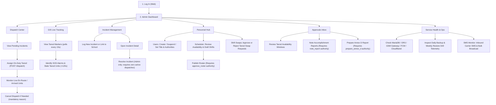

---

## 2. 🟢 Secretary (Records & Reports Officer)

* **Platform:** Web Desktop (`https://baranguardph.win`)
* **Default Landing Page:** `incident-management` *(Code: `main.js` routes secretary directly here; dashboard is inaccessible to Secretary)*
* **Core Function:** Statutory records custodian (RA 7160 §394c), confidential narrative reviewer, incident lifecycle governor, Safer School Zones administrator, and citizen report triage.

### Complete Navigation Reach (8 Sidebar Items)
`incident-management`, `citizen-inbox`, `approvals`, `accomplishment-reports`, `referrals`, `school-zones`, `personnel`, `settings`.  
*(Excluded by `PAGE_ROLES`: `dashboard`, `dispatch`, `gis`, `analytics`, `sms-log`, `audit-log`, `service-health`, `map-packages`)*

### Operational Flow

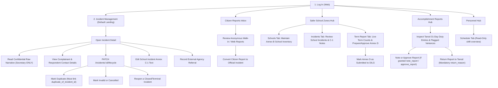

---

## 3. 🟡 Punong Barangay (Barangay Captain / Executive Oversight)

* **Platform:** Web Desktop (`https://baranguardph.win`)
* **Default Landing Page:** `dashboard` (Read-only executive analytics with pending approvals widget)
* **Core Function:** Executive oversight, high-level intelligence and GIS monitoring, and statutory signing/approval authority for rosters, accomplishment reports, and term submissions.

### Complete Navigation Reach (9 Sidebar Items)
`dashboard`, `gis`, `approvals`, `accomplishment-reports`, `referrals`, `school-zones`, `analytics`, `personnel`, `settings`.  
*(Excluded by `PAGE_ROLES`: `dispatch`, `incident-management`, `citizen-inbox`, `sms-log`, `audit-log`, `service-health`, `map-packages`)*

### Operational Flow

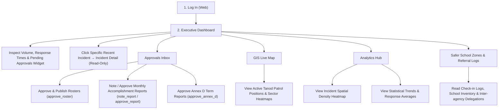

---

## 4. 🔴 Tanod (Patrol Responder / Field Operative)

* **Platform:** Mobile Android App (Ionic React + Capacitor + SQLCipher encrypted database)
* **Shell Structure:** 5 Persistent Bottom Tabs (`Home`, `Dispatches`, `Report [+]`, `Map`, `Profile`) + Contextual Sub-Pages.
* **Core Function:** Responding to emergency dispatches, emergency SOS panic broadcast, turn-by-turn navigation, photo/audio evidence collection, school zone check-ins, availability submission, and daily accomplishment reporting.

### Operational Flow

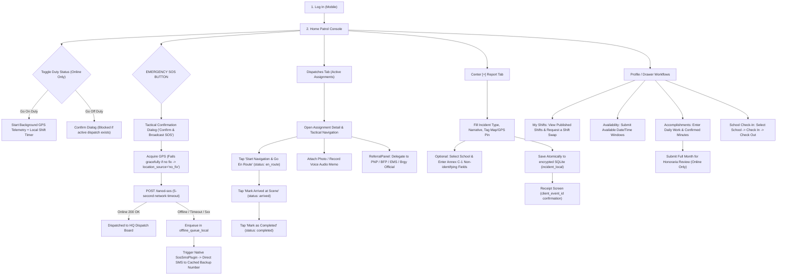

---

## 5. 🟣 Citizen (Public Informant)

* **Platform:** Public Web Form (`https://baranguardph.win/#/citizen-report`)
* **Access Level:** Zero authentication, zero account required.
* **Core Function:** Secure, anonymous walk-in or remote reporting of neighborhood incidents directly to the barangay desk.

### Operational Flow

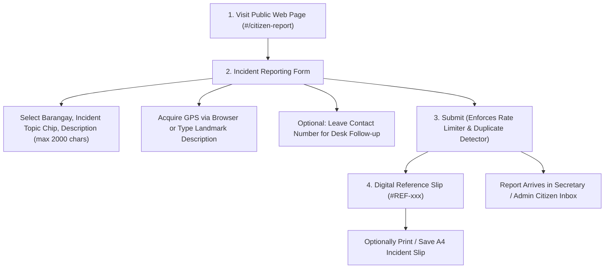

---

# Part 2: Codebase State Machines

Every state machine in Baranguard is strictly validated on the backend. The following tables and diagrams show the exact states, trigger endpoints, and database columns.

---

### 1. Incident Lifecycle & Resolution
* **Database Columns:** `incident.status` (`pending`, `dispatched`, `resolved`, `duplicate`, `invalid`, `cancelled`, `reopened`) and `incident.duplicate_of_incident_id`
* **Authority Gate:** Admin resolves (`/status`); Secretary governs records lifecycle (`/lifecycle`).

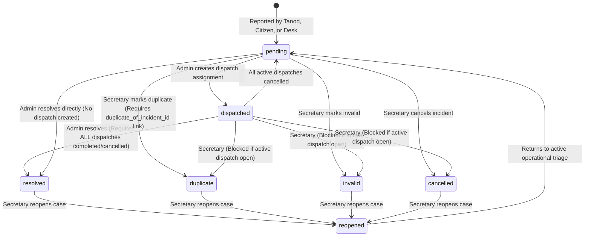

---

### 2. Dispatch Assignment Status
* **Database Column:** `dispatch.status` (`assigned`, `en_route`, `arrived`, `completed`, `cancelled`)
* **Trigger Endpoints:** Admin creates/cancels (`/dispatch`, `/dispatch/:id/cancel`); Tanod advances (`PATCH /dispatch/:id/status`).

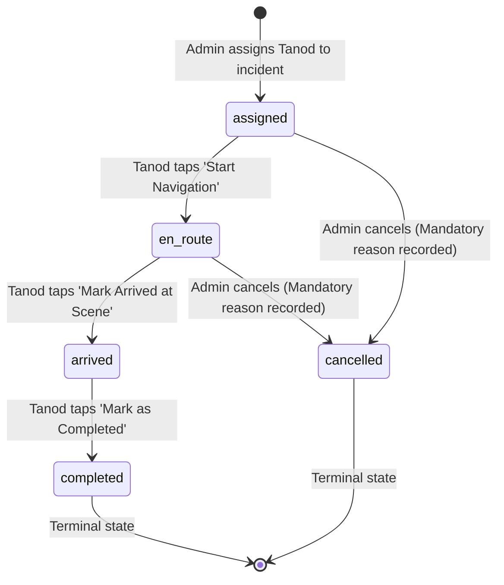

---

### 3. Monthly Accomplishment Report
* **Database Column:** `accomplishment_report.status` (`open`, `prepared`, `noted`, `approved`, `returned`)
* **Authority Gate:** Tanod submits; holders of `note_report` note; holders of `approve_report` approve. Preparer can never note/approve (`assertNotPreparer`).

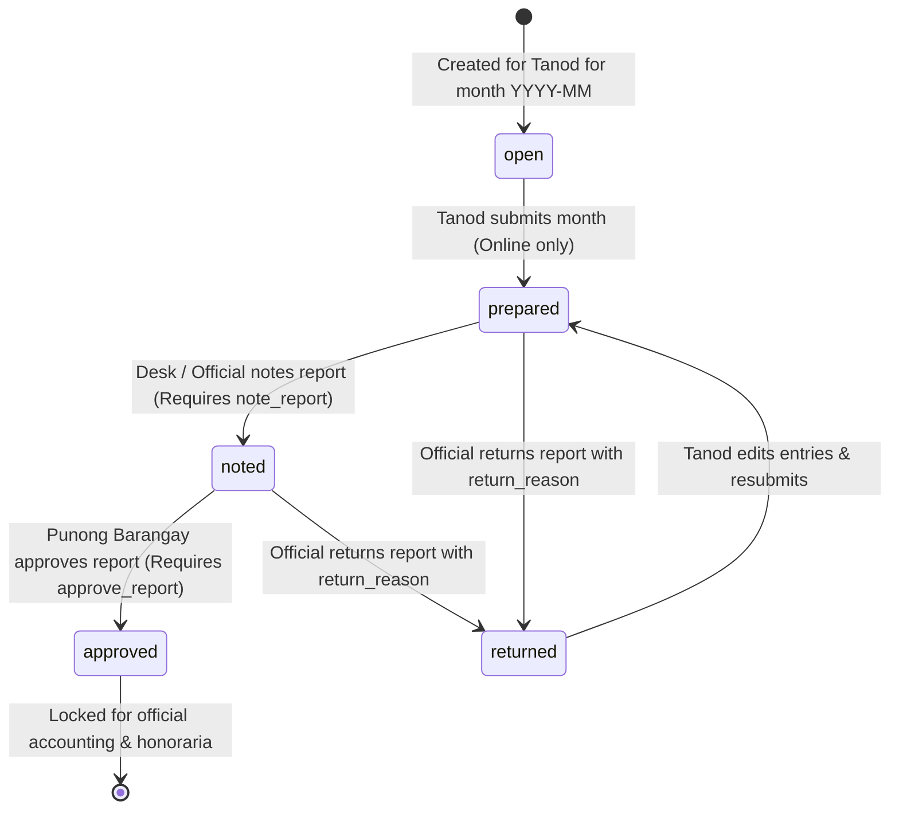

---

### 4. Shift Schedule & Roster Publication
* **Database Column:** `shift_schedule.approval_status` (`draft`, `published`)
* **Authority Gate:** Admin creates draft; holder of `approve_roster` publishes.

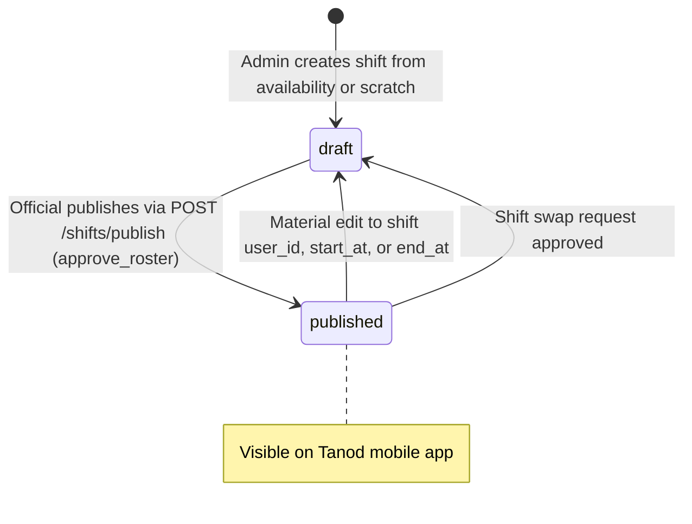

---

### 5. Safer School Zones Annex D Term Report
* **Database Column:** `ssz_term_report.status` (`draft`, `prepared`, `approved`, `submitted`)
* **Authority Gate:** Admin/Secretary drafts; `prepare_annex_d` prepares; `approve_annex_d` approves; Admin/Secretary marks submitted. Preparer cannot approve.

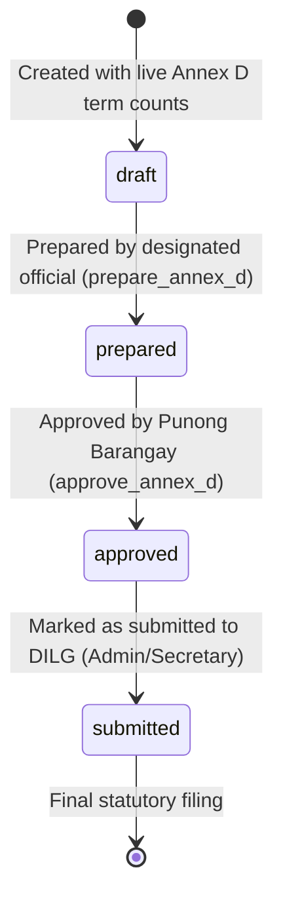

---

### 6. Tanod Emergency SOS Panic Alert
* **Database Column:** `tanod_sos.status` (`active`, `acknowledged`, `resolved`)
* **Trigger Endpoints:** Tanod triggers (`POST /tanod-sos`); Admin acknowledges (`/acknowledge`); Admin resolves (`/resolve`).

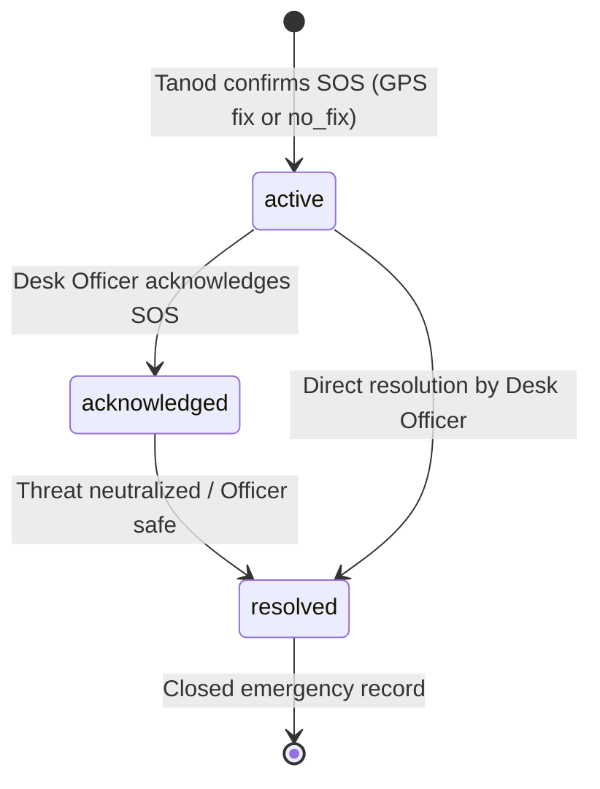

---

# Part 3: Business Rules (One Sentence Per Rule)

### I. Authentication, Sessions & Tenancy
1. Every authenticated user must supply a valid username and password; anonymous access is strictly restricted to the public citizen report route.
2. An account is locked for 15 minutes after 5 failed login attempts within a rolling 15-minute window.
3. Web sessions use a 15-minute sliding JWT refreshed automatically by dashboard polling, while mobile tanod sessions use a 24-hour sliding token capped at 7 days.
4. Logging out, suspension, deactivation, or password changes instantly revoke all active session tokens on the server.
5. All tenant-isolated database queries strictly enforce `barangay_id`, and any cross-tenant request returns a `404 Not Found` rather than a `403` to prevent confirming the existence of resources in other barangays.
6. Server-side middleware validates role, tenant, and resource ownership on every protected endpoint; client-side guards are never treated as security boundaries.

### II. Incident Dispatch & Operations
7. Only an Admin can create a dispatch assignment to deploy an on-duty Tanod to an incident.
8. A Tanod cannot be dispatched if they are off-duty, already responding, inactive, suspended, or from another barangay.
9. An incident supports multiple concurrent responder dispatches without artificial priority gates.
10. Cancelling an active dispatch reverts an incident to `pending` only when no other active responder remains assigned.
11. An Admin can resolve an incident only after all associated responder dispatches are marked completed or cancelled.
12. Only a Secretary can modify an incident's statutory lifecycle to `duplicate`, `invalid`, `cancelled`, or `reopened`.
13. Marking an incident as `duplicate` strictly requires linking it to a target `duplicate_of_incident_id` within the same barangay, preserving both records without deleting or merging data.
14. A terminal incident state (`resolved`, `cancelled`, `invalid`, `duplicate`) can only transition to `reopened` and cannot jump directly to another terminal state.
15. Incident status or lifecycle modifications are rejected with a conflict error if an active dispatch is open.
16. Web writes require a UUID `Idempotency-Key` and mobile writes require a `client_event_id`; replayed requests return the original row rather than creating duplicates.

### III. Data Privacy, Redaction & Statutory Compliance
17. Raw incident narratives are stored encrypted and never transmitted via push notifications, SMS alerts, server logs, or audit metadata.
18. Only a Secretary can view an incident's confidential raw narrative and party contact details; Admins and Punong Barangays receive only non-identifying operational summaries.
19. All raw narratives are permanently purged after a mandatory 90-day retention ceiling.
20. Audit log entries are strictly append-only and record allow-listed entity identifiers and statuses without personal identifiers, narratives, or coordinates.
21. Baranguard strictly functions as an operational dispatch tool and may never be presented as replacing DILG's mandated BIMSS/KPIS case registry.

### IV. Emergency SOS & Field Safety
22. The emergency SOS broadcast must never be blocked by a missing or failed GPS fix; the server records a fallback position or flags the alert as `no_fix`.
23. If the server is unreachable, the mobile app sends a direct emergency SMS to the cached backup contact number via the phone's native SIM.
24. Acknowledging an SOS alert notifies the operator but does not dismiss the visual emergency alert banner until the distress is explicitly marked resolved.
25. The SOS mobile trigger opens a tactical confirmation dialog to prevent accidental triggers while guaranteeing immediate transmission upon confirmation.

### V. Scheduling, Rostering & Duty Limits
26. Newly created shifts default to `draft` status and remain invisible on the mobile app until published by an official holding `approve_roster` authority.
27. A Tanod cannot be scheduled for more than 12 hours within a single Asia/Manila calendar day.
28. Materially editing a published shift's assigned officer, start time, or end time immediately reverts its status to `draft` and revokes its approval.
29. Shift swap requests raised against `draft` shifts return a `404 Not Found` because draft rosters are hidden from field personnel.
30. Missing duty coverage across a patrol zone generates a warning during roster publication but does not block publication.
31. Approving a shift swap request reverts the shift to `draft`, requiring re-publication by an authorized official.

### VI. Tanod Availability & Accomplishment Reports
32. A Tanod can revise and resubmit duty availability time windows for a period while its status is `submitted`, but modifications are locked once `accepted`.
33. The server computes suggested duty durations from recorded `on_duty` intervals and flags any accomplishment entry where the Tanod's confirmed duration differs by more than 30 minutes.
34. Final monthly accomplishment reports must be submitted online and cannot be queued through the offline sync worker.
35. The preparer of an accomplishment report can never note or approve their own report.
36. Administrators cannot grant or revoke approving authorities on their own user account; changes require action from a second administrator.

### VII. Agency Referrals & External Handoffs
37. Logging an inter-agency referral records an operational handoff to an external body without altering the incident's dispatch status.
38. The referral log exposes only destination agency categories and reference codes, excluding personal identifying information and narrative text.

### VIII. Safer School Zones (DILG MC 2026-037)
39. School check-in timestamps must be valid ISO-8601 strings within 5 minutes in the future and no older than 62 days in the past.
40. School check-out timestamps cannot precede check-in and must occur within 24 hours of arrival.
41. An invalid or inactive `school_id` submitted from mobile is saved as NULL rather than rejecting the offline incident report.
42. Annex D term reports require preparation by an official with `prepare_annex_d` and approval by a separate official with `approve_annex_d` before being marked submitted.
43. School incident records carry short, non-identifying Annex C-1 fields that strictly forbid recording student names or identifying details.

### IX. Mobile Offline Architecture & Sync Queue
44. Every mobile field submission persists immediately to encrypted local SQLite storage before navigation can continue.
45. Mobile synchronization processes queued items in strict priority: SOS alerts first, dispatch updates second, incidents third, workflow items fourth, and GPS breadcrumbs last.
46. Sync batches are limited to 50 items per payload with GPS breadcrumbs capped at 200 points per sync pass.
47. Duplicate sync payloads matching an existing `client_event_id` return the existing server row rather than throwing an error.
48. Non-transient client sync rejections revert optimistic local status changes and mark the queue item as requiring attention.
49. Duty status cannot be toggled while offline, and an officer cannot declare themselves off-duty while an active dispatch assignment remains open.

### X. Data Retention, Backup & System Governance
50. Retention rules are enforced as constants in code, and modifications require architectural and council policy approval.
51. GPS tracking breadcrumbs, duty status logs, shift assignments, and notification records are purged after a 1-year retention period.
52. Encrypted database backups run nightly and restore drills execute weekly via automated workstation scheduled tasks.
53. Backups dated after an active legal hold are protected against automated pruning.
54. All server timestamps are stored in UTC, and calendar day calculations use a fixed Asia/Manila (+08:00) offset in PHP rather than SQL timezone conversions.
55. The workstation serves four fixed barangays in Pilar, Sorsogon, and expanding tenant coverage requires schema migrations.
